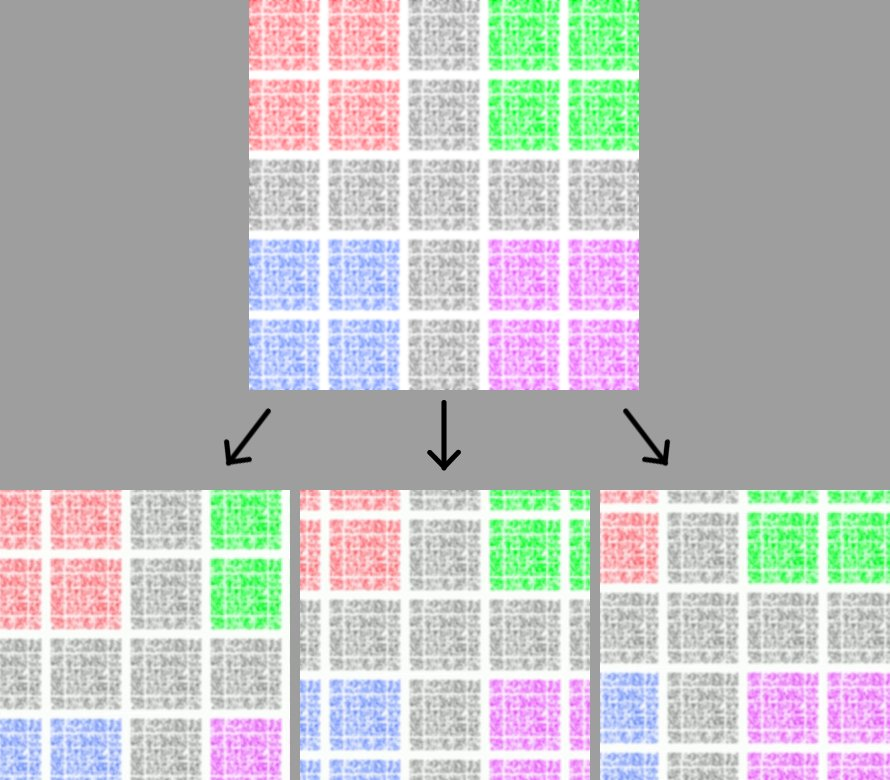

# Random Shifted Backgrounds

Script for creating multiple randomized background images from a single video, by cropping different sections of the video as well as sampling frames over different times throughout the video.

## Usage

Install the library requirements using:

```bash
pip install -r requirements.txt
```

Then run the script using:

```bash
python random_backgrounds.py /path/to/video.mp4
```

The `/path/to/video.mp4` is optional, if left out, a file dialog prompt will pop-up instead (however, repeat usage of the script can be a lot simpler when providing the video path directly).

Other flags exist, mostly to adjust the randomization parameters. Run the script with the `-h` flag to view the other options.

## Examples

Below is an example of a given 'background image' (just a noise pattern in this case), along with 3 randomized shifted outputs. Note that all outputs are the same width & height, but are cropped in from the original (i.e. not as wide/tall). There is always a centered crop output as well.

<p align="center">
  
</p>

## TODOs

- Add rotations

- Add shearing/skewing/warping to mimic perspective change effects
